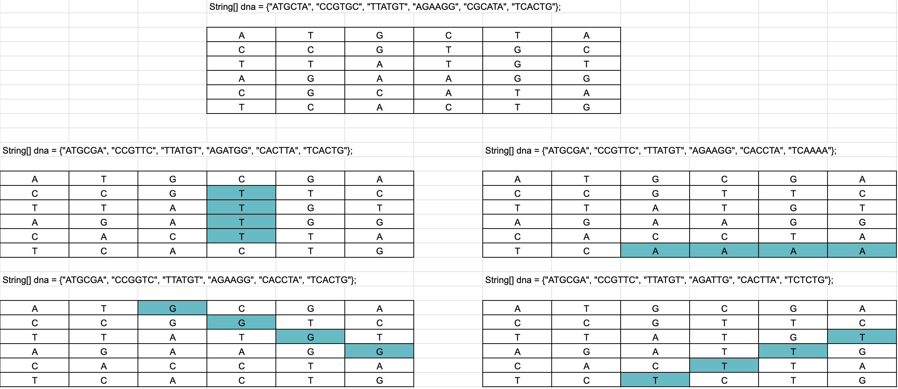
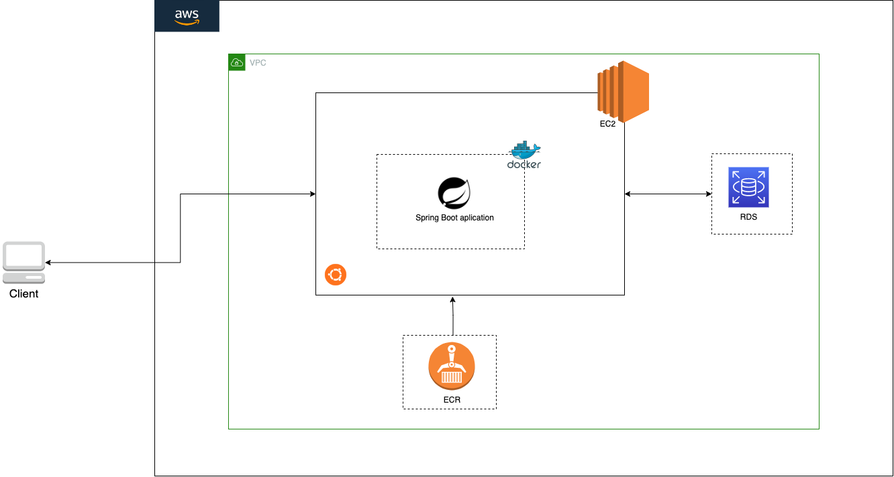
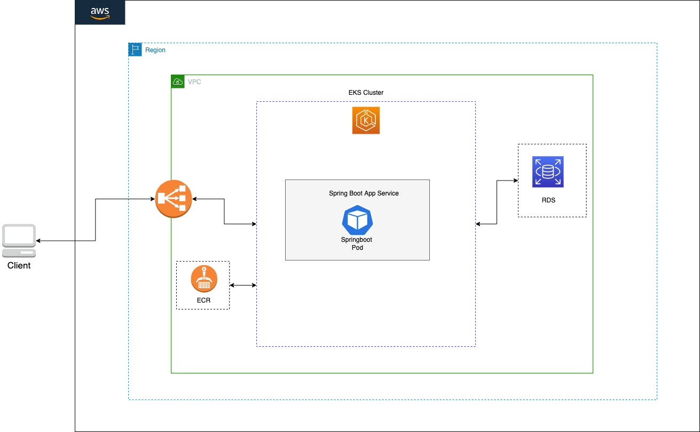

## Mutants API
Mutants es una API proporcionada por los X-Men la cual tiene como objetivo principal saber si un humano es muntante. Ademas tambien se pueden consultar la cantidad de humanos y mutante que estan registrados en el sistema del profesor Charles Xavier.

### Tags
Java, Spring Boot, RDS PostgreSQL, AWS EKS, AWS ECR, Docker

### Conbinaciones de AND`s

### Arquitectura v1

### Arquitectura v2
Como parte de la evolución y para atender el requerimiento no funcional de la alta concurrencia de los servicios, como medida se implementó una arquitectura sobre Kubernetes para poder gestionar el escalado horizontal y vertical. Cabe anotar que esta es solo una de las medidas que ayudan resolver dicho requerimiento.

### Como usar

**Metodo**: isMuntant

**Descripcion**: Este metodo permite saber si un humano es muntante

**URL**: `http://3.82.60.183:8081/mutant`

**URL Load Balancer EKS**: `http://a68245d0595e54910bee3faa03657482-274081695.us-east-1.elb.amazonaws.com/mutant`

** Header **: `Content-Type: application/json`

**Method**: `POST`

**Body**:

		{
		 "dna": ["AAAATA", "CCGTGC", "TTATGT", "AGAAGG", "CGCATA", "TCACTG"]
		}

#### Ejemplo con cURL

	curl --location --request POST 'http://3.82.60.183:8081/mutant' \
	--header 'Content-Type: application/json' \
	--data-raw '{
	 "dna":["AAAATA", "CCGTGC", "TTATGT", "AGAAGG", "CGCATA", "TCACTG"]
	}'

--------------------------------

**Método**: stats

**Descripción**: Este método retorna la cantidad de ADN´s identificados como humanos y mutantes

**URL**: `http://3.82.60.183:8081/stats`

**URL Load Balancer EKS**: `http://a68245d0595e54910bee3faa03657482-274081695.us-east-1.elb.amazonaws.com/stats`

**Method**: `GET`

#### Ejemplo con cURL

	curl --location --request GET 'http://3.82.60.183:8081/stats'

